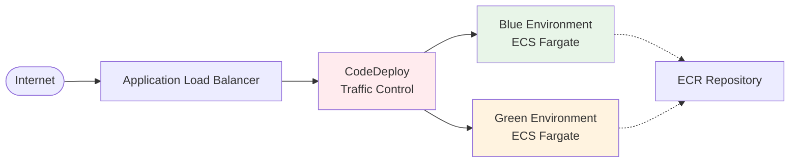

# AWS ECS Blue/Green デプロイメントサンプル

AWS ECS Fargateを使用したコンテナ実行環境で、CodeDeployによるBlue/Greenデプロイメントを実装するサンプルプロジェクトです。

## 特徴

- **マルチAZ構成**: 高可用性を実現するVPC設計
- **Blue/Greenデプロイ**: CodeDeployによる無停止デプロイメント
- **CI/CD対応**: GitHub ActionsとOIDC認証
- **Infrastructure as Code**: CloudFormationによる環境管理
- **コスト最適化**: Fargateによる従量課金とリソース最適化

## アーキテクチャ概要



- **VPC**: 10.0.0.0/16 (マルチAZ構成)
- **ECS Fargate**: CPU 256, Memory 512MB × 2タスク
- **CodeDeploy**: Blue/Green無停止デプロイメント

## ユースケース別手順

### 初期構築（インフラ構築）

#### 1. AWSリソース構築
```bash
# ネットワーク
aws cloudformation create-stack \
  --stack-name ecs-bg-deploy-network \
  --template-body file://aws/cloudformation/network.yaml \
  --parameters ParameterKey=ProjectName,ParameterValue=ecs-bg-deploy

# ECRリポジトリ
aws cloudformation create-stack \
  --stack-name ecs-bg-deploy-ecr \
  --template-body file://aws/cloudformation/ecr.yaml \
  --parameters ParameterKey=ProjectName,ParameterValue=ecs-bg-deploy

# 初回イメージプッシュ
./scripts/build.sh v1.0.0

# Blue/Green環境構築
aws cloudformation create-stack \
  --stack-name ecs-bg-deploy-bluegreen \
  --template-body file://aws/cloudformation/ecs-bluegreen.yaml \
  --parameters ParameterKey=ProjectName,ParameterValue=ecs-bg-deploy \
               ParameterKey=ImageTag,ParameterValue=v1.0.0 \
  --capabilities CAPABILITY_IAM
```

#### 2. GitHub Actions用OIDC設定（CI/CD使用時のみ）
```bash
# OIDCプロバイダー作成（初回のみ）
aws iam create-open-id-connect-provider \
  --url https://token.actions.githubusercontent.com \
  --client-id-list sts.amazonaws.com \
  --thumbprint-list 6938fd4d98bab03faadb97b34396831e3780aea1

# IAMロール作成
aws cloudformation create-stack \
  --stack-name ecs-bg-deploy-github-oidc \
  --template-body file://aws/cloudformation/github-oidc.yaml \
  --parameters ParameterKey=ProjectName,ParameterValue=ecs-bg-deploy \
               ParameterKey=GitHubOrg,ParameterValue=YOUR_GITHUB_USERNAME \
               ParameterKey=GitHubRepo,ParameterValue=sample-aws-ecs-blue-green-deploy \
  --capabilities CAPABILITY_NAMED_IAM

# GitHub Secrets設定
# Settings > Secrets and variables > Actions で AWS_ROLE_ARN を設定
```

### 開発（ローカルでの検証）

#### ソース修正からデプロイまで
```bash
# 1. ソースコード修正
vim index.html

# 2. 事前検証（オプション）
./test/verify.sh

# 3. 統合テスト（オプション）
./test/test-deploy.sh

# 4. 本番デプロイ
./scripts/dev-deploy.sh v2.0.0
```

#### 段階的実行
```bash
# ビルドのみ
./scripts/build.sh v2.0.0

# デプロイのみ（既存イメージ使用）
./scripts/deploy.sh v2.0.0
```

### GitHub Actionsでのデプロイ

#### タグプッシュでの自動デプロイ
```bash
# vで始まるタグプッシュで自動実行
git tag v2.0.0
git push origin v2.0.0
```

#### 手動実行
```bash
# GitHub > Actions > "Blue/Green Deploy" > "Run workflow"
# バージョンを入力して実行
```

> **注意**: 通常のブランチプッシュでは自動実行されません

## ドキュメント

- **[Blue/Greenデプロイ手順](docs/blue-green-deploy.md)**: デプロイの実行方法
- **[スクリプト責務設計](docs/scripts-responsibility.md)**: 各スクリプトの役割と使い分け
- **[GitHub Actionsガイド](docs/github-actions-guide.md)**: CI/CD設定とトラブルシューティング

## ディレクトリ構成
```
.
├── aws/cloudformation/     # CloudFormationテンプレート
├── docs/                   # ドキュメント
│   ├── blue-green-deploy.md
│   ├── scripts-responsibility.md
│   └── github-actions-guide.md
├── scripts/               # デプロイスクリプト
│   ├── build.sh           # イメージビルド・プッシュ
│   ├── deploy.sh          # Blue/Greenデプロイ
│   └── dev-deploy.sh      # 統合デプロイ
├── test/                  # テスト・検証スクリプト
│   ├── verify.sh          # 事前検証
│   └── test-deploy.sh     # 統合テスト
├── .github/workflows/     # GitHub Actions
├── appspec.yaml          # CodeDeploy設定
├── Dockerfile            # アプリケーションイメージ
└── index.html            # サンプルアプリ
```