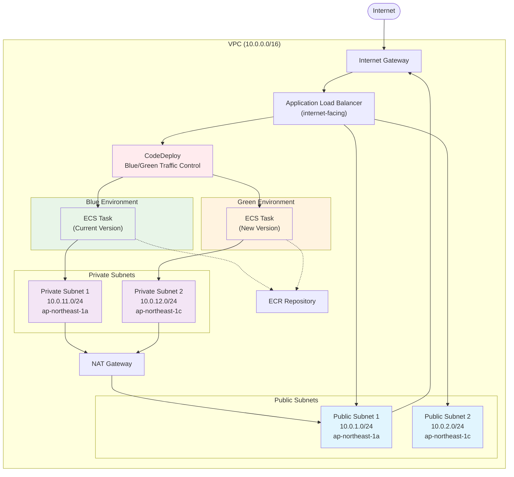
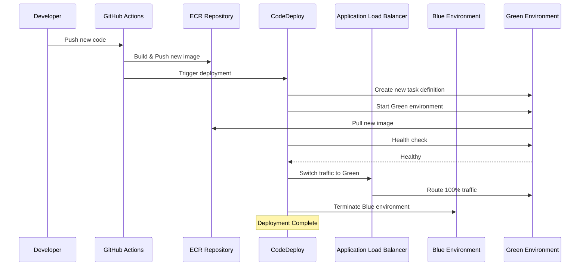

# システムアーキテクチャ

## 概要
AWS ECS Fargateを使用したコンテナ実行環境で、Blue/Greenデプロイメントに対応したアーキテクチャです。

## システム構成図

### Blue/Green構成（ecs-bluegreen.yaml）

### デプロイフロー

## ネットワーク設計

### VPC構成
- **CIDR**: 10.0.0.0/16
- **DNS解決**: 有効
- **DNSホスト名**: 有効

### サブネット設計
| サブネット | CIDR | AZ | 用途 |
|-----------|------|----|----- |
| Public Subnet 1 | 10.0.1.0/24 | ap-northeast-1a | ALB, NAT Gateway |
| Public Subnet 2 | 10.0.2.0/24 | ap-northeast-1c | ALB |
| Private Subnet 1 | 10.0.11.0/24 | ap-northeast-1a | ECS Tasks |
| Private Subnet 2 | 10.0.12.0/24 | ap-northeast-1c | ECS Tasks |

### ルーティング
- **Public Subnets**: Internet Gateway経由でインターネットアクセス
- **Private Subnets**: NAT Gateway経由でアウトバウンドのみ

## セキュリティ設計

### セキュリティグループ
| 名前 | 方向 | プロトコル | ポート | ソース/宛先 | 用途 |
|------|------|-----------|--------|-------------|------|
| ALB-SG | Inbound | TCP | 80 | 0.0.0.0/0 | インターネットからのHTTPアクセス |
| ECS-SG | Inbound | TCP | 80 | ALB-SG | ALBからコンテナへのアクセス |

### IAMロール
| ロール名 | 用途 | 権限 |
|----------|------|------|
| TaskExecutionRole | ECSタスク実行 | ECRアクセス、CloudWatch Logs書き込み |
| CodeDeployServiceRole | CodeDeploy実行 | ECSサービス制御、ALB制御 |
| GitHubActionsRole | CI/CD | ECR、ECS、CodeDeploy操作 |

## コンピューティングリソース

### ECS設定
- **起動タイプ**: Fargate
- **CPU**: 256 (0.25 vCPU)
- **メモリ**: 512 MB
- **タスク数**: 2 (冗長構成)
- **ネットワークモード**: awsvpc

### ロードバランサー設定
- **タイプ**: Application Load Balancer
- **スキーム**: internet-facing
- **ヘルスチェック**: HTTP GET /
- **ヘルスチェック間隔**: 30秒

## 監視・ログ

### CloudWatch Logs
- **ロググループ**: `/ecs/ecs-bg-deploy`
- **保持期間**: 7日間
- **ログドライバー**: awslogs

### メトリクス
- ECSサービスメトリクス（CPU使用率、メモリ使用率）
- ALBメトリクス（リクエスト数、レスポンス時間）
- ターゲットグループヘルスチェック

## Blue/Greenデプロイメント

### CodeDeploy設定
- **デプロイ設定**: CodeDeployDefault.ECSAllAtOnceBlueGreen
- **トラフィック制御**: ALBリスナールール切り替え
- **ロールバック**: 自動（失敗時、アラーム時）
- **Blue環境終了**: 成功後5分

### デプロイフロー
1. **新しいタスク定義作成**: Green環境用の新しいタスク定義を作成
2. **Green環境起動**: 新しいバージョンでタスクを起動
3. **ヘルスチェック**: Green環境の正常性を確認
4. **トラフィック切り替え**: ALBのトラフィックをGreenに切り替え
5. **Blue環境終了**: 旧バージョン（Blue）を終了

## 拡張性・可用性

### 高可用性
- マルチAZ構成（2つのAZ）
- 複数タスクでの冗長化
- ALBによる自動フェイルオーバー

### スケーラビリティ
- ECS Service Auto Scaling（将来拡張）
- ALBによる負荷分散
- Fargateによる自動リソース管理

## コスト最適化

### リソース最適化
- Fargateによる従量課金
- 最小限のCPU/メモリ設定
- CloudWatch Logs短期保持
- NAT Gateway単一AZ配置

### 推定月額コスト（東京リージョン）
- Fargate: 約$15-20（2タスク常時稼働）
- ALB: 約$20-25
- NAT Gateway: 約$45
- その他（ECR、CloudWatch）: 約$5
- **合計**: 約$85-95/月