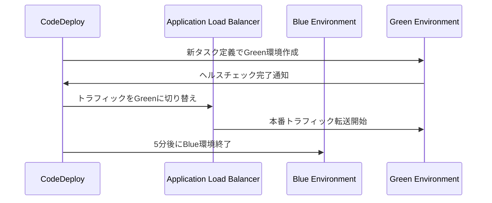

# CodeDeploy Blue/Green デプロイガイド

## CodeDeploy構成

### アプリケーション設定

| 項目 | 値 | 説明 |
|------|---|------|
| **アプリケーション名** | `ecs-bg-deploy-app` | CodeDeployアプリケーション |
| **プラットフォーム** | `ECS` | コンテナベースデプロイ |
| **デプロイメントグループ** | `ecs-bg-deploy-dg` | デプロイ対象の管理単位 |

### デプロイ設定

| 設定項目 | 値 | 効果 |
|---------|---|------|
| **デプロイ設定** | `CodeDeployDefault.ECSAllAtOnceBlueGreen` | 全トラフィック一括切り替え |
| **デプロイタイプ** | `BLUE_GREEN` | 無停止デプロイメント |
| **トラフィック制御** | `WITH_TRAFFIC_CONTROL` | ALBによる段階的切り替え |

## Blue/Green環境管理

### 環境切り替えフロー



### 環境設定

| 環境 | 役割 | ライフサイクル |
|------|------|---------------|
| **Blue** | 現在の本番環境 | デプロイ成功後5分で自動終了 |
| **Green** | 新しいデプロイ環境 | ヘルスチェック後に本番環境に昇格 |

## appspec.yaml設定

```yaml
version: 0.0
Resources:
  - TargetService:
      Type: AWS::ECS::Service
      Properties:
        TaskDefinition: <TASK_DEFINITION>  # 動的に置換
        LoadBalancerInfo:
          ContainerName: "app"
          ContainerPort: 80
```

### 設定項目説明

| 項目 | 説明 | 動作 |
|------|------|------|
| **TaskDefinition** | 新しいコンテナイメージ | デプロイ時に動的置換 |
| **ContainerName** | ターゲットコンテナ | `app`コンテナを指定 |
| **ContainerPort** | コンテナポート | HTTP:80でサービス提供 |

## 自動ロールバック設定

### ロールバック条件

| 条件 | トリガー | 動作 |
|------|---------|------|
| **DEPLOYMENT_FAILURE** | デプロイ失敗 | 自動的に前バージョンに復旧 |
| **DEPLOYMENT_STOP_ON_ALARM** | CloudWatchアラーム | 監視メトリクス異常時に復旧 |

### ロールバック設定

```yaml
AutoRollbackConfiguration:
  Enabled: true
  Events:
    - DEPLOYMENT_FAILURE
    - DEPLOYMENT_STOP_ON_ALARM
```

## トラフィック制御

### ALB設定

| コンポーネント | 設定 | 役割 |
|---------------|------|------|
| **リスナー** | HTTP:80 | 外部トラフィック受信 |
| **ターゲットグループ** | `ecs-bg-deploy-tg-1` | Blue/Green環境への振り分け |
| **ヘルスチェック** | `GET /` | コンテナ正常性監視 |

### セキュリティグループ

| グループ | 用途 | ルール |
|---------|------|--------|
| **ALBSecurityGroup** | ALB用 | インターネットからHTTP:80許可 |
| **ECSSecurityGroup** | ECSタスク用 | ALBからのHTTP:80のみ許可 |

## デプロイ監視

### 状態確認コマンド

```bash
# デプロイ状況確認
aws deploy get-deployment --deployment-id <DEPLOYMENT_ID>

# ECSサービス状態確認
aws ecs describe-services \
  --cluster ecs-bg-deploy-cluster \
  --services ecs-bg-deploy-service

# タスク状態確認
aws ecs list-tasks \
  --cluster ecs-bg-deploy-cluster \
  --service-name ecs-bg-deploy-service
```

### 監視メトリクス

| メトリクス | 監視項目 | 閾値 |
|-----------|---------|------|
| **HealthyHostCount** | 正常なターゲット数 | 最低1台 |
| **ResponseTime** | レスポンス時間 | 1秒以下 |
| **HTTPCode_Target_5XX_Count** | サーバーエラー | 0件 |

## 運用上の注意点

### リソース使用量

| フェーズ | CPU使用量 | メモリ使用量 | 期間 |
|---------|-----------|-------------|------|
| **通常運用** | 256 CPU × 2タスク | 512MB × 2タスク | 常時 |
| **デプロイ中** | 256 CPU × 4タスク | 512MB × 4タスク | 約5分 |

### コスト影響

- **デプロイ中**: 一時的にリソース2倍使用（約5分間）
- **成功後**: Blue環境自動削除でコスト最適化
- **失敗時**: 自動ロールバックで追加コストなし

### 制限事項

| 項目 | 制限 | 対処法 |
|------|------|--------|
| **同時デプロイ** | 1つまで | 前回デプロイ完了後に実行 |
| **ロールバック期間** | デプロイ後24時間 | 手動でタスク定義を戻す |
| **ダウンタイム** | 0秒 | Blue/Green切り替えで無停止 |